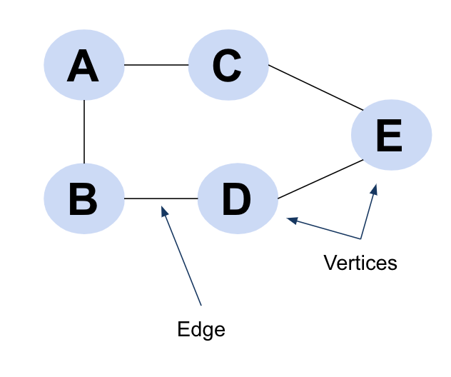

# Graphs

### Introduction

Graphs are non-linear data structure consisting of vertices and edges. The mathematical definition for a graph is : **G = \(V, E\)**, where V is the set of vertices and E is the set of edges, where an edge connects two vertices.

We can see several examples of graphs all around us. These are some of the very popular real world examples of graphs -

* Facebook Friends or LinkedIn connections are great representations of graphs in social networks.
* Google's Knowledge Graph uses graph to connect entities and the relationships between them.
* Google Maps, Uber Ride Matching uses the path optimization algorithms to find the shortest routes from a source to a destination.

### Graph Representation

* Adjacency Matrix
* Adjacency List

### Different Types of Graphs

* Directed & Undirected Graphs
* Weighted & Unweighted Graphs
* Connected & Disconnected Graphs

### Graph Traversal

* [Breadth First Search \(BFS\)](https://www.youtube.com/watch?v=oDqjPvD54Ss)
* [Depth First Search \(DFS\)](https://www.youtube.com/watch?v=7fujbpJ0LB4)

### Graph Concepts & Algorithms

* Cycle Detection
  * Cycle in Directed graphs
  * Cycle in Undirected graphs
* Graph Coloring
* Connectivity
  * Tarjan’s algorithm for Articulation Points Graph
  * Eulerian Path & Circuit
  * Kosaraju’s algorithm for Strongly Connected Components
* Topological Sorting
  * Kahn’s Algorithm
  * DFS based approach
* Spanning Tree
  * Prim’s Minimum Spanning Tree \(MST\)
  * Kruskal’s Minimum Spanning Tree Algorithm
* [Finding Shortest Path in a Graph](shortest-path-algorithms.md)
  * Dijkstra’s shortest path algorithm
  * Floyd Warshall Algorithm
  * Bellman-Ford algorithm
* Maximum Flow
  * Ford-Fulkerson Algorithm for Maximum Flow Problem
* Other Problems 
  * Traveling Salesman Problem 

### References

* [https://www.geeksforgeeks.org/graph-data-structure-and-algorithms/](https://www.geeksforgeeks.org/graph-data-structure-and-algorithms/)
* [https://medium.com/basecs/a-gentle-introduction-to-graph-theory-77969829ead8](https://medium.com/basecs/a-gentle-introduction-to-graph-theory-77969829ead8)
* https://web.stanford.edu/class/archive/cs/cs106x/cs106x.1192/lectures/Lecture25/Lecture25.pdf
* [https://dl.acm.org/doi/pdf/10.1145/368996.369025](https://dl.acm.org/doi/pdf/10.1145/368996.369025)
* [https://leapgraph.com/graph-data-structures-applications](https://leapgraph.com/graph-data-structures-applications)

