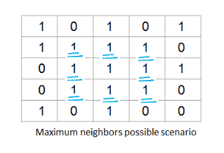
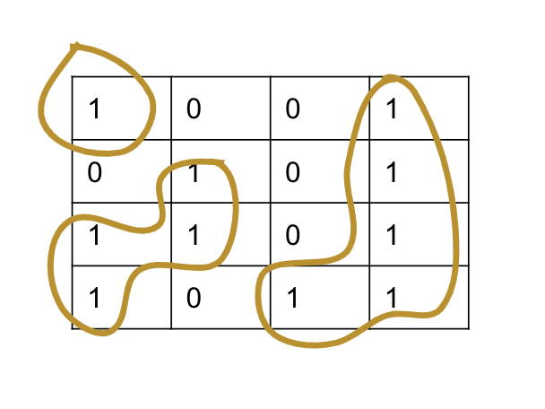
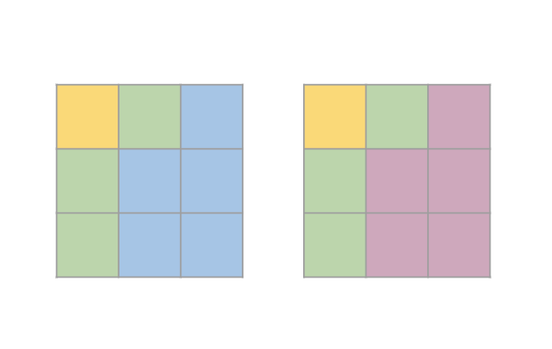
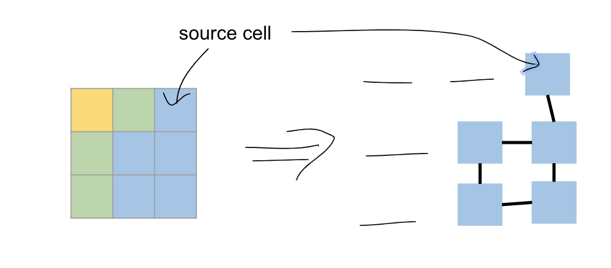

# Number of Islands & Variations

This is another very popular interview question asked in various company interviews. Once you get the basics right, you can solve all the variations very easily.


Concepts of **matrix** and **graph theory** \(depth-first-search, connected components\) are core to understanding and solving this problem.


Before, we dive further, let's briefly revise following two topics

* Basic concepts of matrix,
* Connected Components in a Graph

#### Basic concepts of Matrix 

A matrix is a two-dimensional data object made of m rows and n columns, therefore having total m x n values.


#### Adjacent neighbors of an element in matrix.

The below figure highlights all the adjacent neighbors of an element at row 2 and column 2. There are 8 neighbors in total : 2 horizontally, 2 vertically and 4 diagonally.



#### Boundary conditions for an element in matrix

We need to carefully handle the boundary conditions for an element in a matrix for these problems. Let's say a matrix has m rows and n cols, then a typical boundary condition check for a cell with position \(i , j\) should be :

```java
if (i >= 0 && i < m && j >= 0 && j < n)  {
    // It is a valid cell.
}
```

We are basically checking that row value, i is within bounds 0 to m-1 and column value lies within 0 to n-1.

#### Connected Components in a Graph

[Depth First Search Algorithm \| Graph Theory](https://www.youtube.com/watch?v=7fujbpJ0LB4) This video is a great resource to revise the concepts of depth-first-search and connected components. 


Once you understand this concept, before you move further try solving this question ➡ [Number of Connected Components in an Undirected Graph](https://leetcode.com/problems/number-of-connected-components-in-an-undirected-graph/)


## **Number of Islands**

> Given a 2d grid map of '1's \(land\) and '0's \(water\), count the number of islands. An island is surrounded by water and is formed by connecting adjacent lands horizontally or vertically. You may assume all four edges of the grid are all surrounded by water.



There are a lot of details left out with the intention that we will ask follow up questions to get more clarity. Here are some typical **follow up** questions which can be asked -

* Does the matrix have the same number of columns or rows? **Not necessarily.**
* Just to clarify, the cell can be adjacent only horizontally and vertically, **not diagonally**? This means a cell can have at max only 4 adjacent cells.
* Can we modify the matrix in order to solve this problem? **Assume you can, we can later explore the case when modification is not allowed.**

### Intuition

Now, you already know how to find number of connected components in a graph, the question is how to apply that here. While finding connected components, we do the following -

* Start with a root node in a graph.
* Using DFS/BFS we traverse through the node.
* We also mark nodes as visited once we are done.
* We repeat this process with unvisited nodes if remaining.
* The number of times we repeat this process, is the connected component count.

In order to apply this here, we need to define what a node is in this context, how to find edges and how to mark them visited.

The intuition is that each element with a value of '1' in the 2d  matrix is a node and the matrix itself represents an undirected graph. There is an edge between two horizontally or vertically adjacent neighbor nodes of value '1'.  


In this above image, we represented a 2x3 matrix filled with 1s and 0s as a graph. This graph has 4 nodes because there were 4 cells with 1s in the matrix. When we add an edge between horizontally or vertically adjacent neighbor nodes of value '1', then we can see that there are 2 connected components in this graph. 

In order to mark a cell visited, in this context we can either modify the existing matrix or use another data structure to mark visited nodes/cells.

### Approach \#1 : DFS with input modification

Since the matrix can be represented as a graph, we can use Depth First Search to find the connected components count. If a node contains a '1', then it is a root node that triggers a DFS. During DFS, every visited node can be set as '0' to mark as visited node. We will modify the input here in order to save some space. 

Then, we can count the number of root nodes that trigger DFS, this number would be the number of islands since each DFS starting at some root identifies an island.

Below code shows the java implementation of this approach -

```java
public void dfs(int i, int j, char[][] grid, int m, int n) {
        grid[i][j] = 0;
        int[][] adjPositions = {{-1,0}, {1,0}, {0,-1}, {0,1}};
        for(int[] pos : adjPositions) {
            int newI = i + pos[0];
            int newJ = j + pos[1];
            if(newI >= 0 && newI < m && newJ >= 0 && newJ < n && grid[newI][newJ] == '1') {
                dfs(newI, newJ, grid, m, n);
            }
        }
    }

public int numIslands(char[][] grid) {
        if(grid == null || grid.length == 0 || grid[0].length == 0) {
            return 0;
        }
        int m = grid.length;
        int n = grid[0].length;
        int numIslands = 0;
        for(int i = 0 ; i < m ; ++i) {
            for(int j = 0; j < n ; ++j) {
                if(grid[i][j] == '1') {
                    numIslands++;
                    dfs(i, j, grid, m, n);
                }
            }
        }
        return numIslands;
}
```

#### Time Complexity

We only visit each node once and in the worst case we will visit each element in the matrix when all of the elements are '1'.   
Hence the time complexity is O\(M\*N\), where M is the number of rows and N is the number of columns.

#### Space Complexity

We do not use additional space, hence space complexity is O\(1\). However if we count the recursive call stack of DFS, then the call stack can go M\*N deep when all of the elements are '1'. So, the space complexity will be  O\(M\*N\).

#### Analysis

In general, modification of input is not recommended but in certain cases it is okay to do so. It is worth checking & mentioning this to interviewers. If it isn't allowed, then our next approach solves this without input modification.

### Approach \#2 : DFS without input modification

It is exactly same as the previous approach, however we do not modify the array. Rather we create a boolean 2D array to mark the row/column as visited.

#### Time Complexity

The time complexity is same as in Approach \#1 : O\(M\*N\), where M is the number of rows and N is the number of columns.

#### Space Complexity

We use an additional boolean 2d array of size M\*N to mark nodes as visited. So, the space complexity will be O\(M\*N\).

Below code shows the java implementation of this approach -

```java
public void dfs(int i, int j, char[][] grid, boolean[][] visited , int m, int n) {
        visited[i][j] = true;
        int[][] adjPositions = {{-1,0}, {1,0}, {0,-1}, {0,1}};
        for(int[] pos : adjPositions) {
            int newI = i + pos[0];
            int newJ = j + pos[1];
            if(newI >= 0 && newI < m && newJ >= 0 && newJ < n && grid[newI][newJ] == '1' && !visited[newI][newJ]) {
                dfs(newI, newJ, grid, visited, m, n);
            }
        }
    }
public int numIslands(char[][] grid) {
        if(grid == null || grid.length == 0 || grid[0].length == 0) {
            return 0;
        }
        int m = grid.length;
        int n = grid[0].length;
        boolean[][] visited = new boolean[m][n];
        int numIslands = 0;
        for(int i = 0 ; i < m ; ++i) {
            for(int j = 0; j < n ; ++j) {
                if(grid[i][j] == '1' && !visited[i][j]) {
                    numIslands++;
                    dfs(i, j, grid, visited, m, n);
                }
            }
        }
        return numIslands;
}
```

### Approach \#3 : BFS with/without modification

The core logic is same as in previous approaches. The variation is that instead of applying DFS to traverse, we would use BFS to traverse. Like in BFS, we will use a queue. 

* Start with the root node.
* Put the root node indices into a queue and mark it as visited. 
* Iteratively search the neighbors of enqueued nodes until the queue becomes empty.

For marking as visited, if input modification is allowed, we could set the node value as '0'. If not, then we could use a 2-D boolean array to mark this node as visited.

#### Time Complexity

The time complexity is same as in previous approaches : O\(M\*N\), where M is the number of rows and N is the number of columns. This is because in worst case we will visit all the nodes.

#### Space Complexity

Queue itself takes O\(min\(M,N\)\) because in worst case where the grid is filled with lands, the size of queue can grow up to min\(M,N\).

* With modification : O\(min\(M,N\)\)
* Without input modification : As we use an additional boolean 2d array of size M\*N to mark nodes as visited, then the space complexity will be O\(M\*N\) + O\(min\(M,N\)\) =&gt; O\(M\*N\)

## Flood Fill

> An `image` is represented by a 2-D array of integers, each integer representing the pixel value of the image \(from 0 to 65535\).
>
> Given a coordinate `(sr, sc)` representing the starting pixel \(row and column\) of the flood fill, and a pixel value `newColor`, "flood fill" the image.
>
> To perform a "flood fill", consider the starting pixel, plus any pixels connected 4-directionally to the starting pixel of the same color as the starting pixel, plus any pixels connected 4-directionally to those pixels \(also with the same color as the starting pixel\), and so on. Replace the color of all of the aforementioned pixels with the newColor.
>
> At the end, return the modified image.



In the above image, we performed a flood-fill from blue -&gt; pink. So, all blue cells adjacent to each other horizontally or vertically got converted into pink.

### Intuition

This problem is very similar number of connected islands in matrix problem with a couple of minor variations.

* The starting pixel position will be our root node.
* The edges should be determined by 4 adjacent neighbors of node \(horizontally or vertically\) which have the same color as the starting pixel position.
* We could use the newColor to mark a node as visited as well as it will help us fill the cell with the new color.

That's it!! In this particular problem, the Approach \#1, DFS with modification will work best since the aim is to modify the matrix for cells adjacent to source cell from one color to another color.



Below code shows the java implementation of this approach -

```java
public void floodFill(int[][] image, int sr, int sc, int newColor, int m , int n, int oldValue) {
        if(oldValue == newColor) {
            return;
        }
        image[sr][sc] = newColor;
        int[][] adjIndices = {{-1,0},{0,1},{0,-1},{1,0}};
        for(int[] adjIndex:adjIndices) {
            int x = sr + adjIndex[0];
            int y = sc + adjIndex[1];
            if(x >= 0 && x < m && y >= 0 && y < n && image[x][y] == oldValue) {
                floodFill(image, x, y, newColor, m, n, oldValue);
            }
        }
    }

public int[][] floodFill(int[][] image, int sr, int sc, int newColor) {
        if(image == null || image.length == 0 || image[0].length == 0) {
            return image;
        }
        int m = image.length;
        int n = image[0].length;
        floodFill(image, sr, sc, newColor, m, n, image[sr][sc]);
        return image;
    }
```

## Max Area of Island

> Given a non-empty 2D array grid of 0's and 1's, an island is a group of 1's \(representing land\) connected 4-directionally \(horizontal or vertical.\) You may assume all four edges of the grid are surrounded by water.
>
> Find the maximum area of an island in the given 2D array. \(If there is no island, the maximum area is 0.\)

### Intuition

This is also exactly very similar to number of connected islands in matrix problem with the only variation that we need to count the number of nodes in each connected component and return the maximum value.

In order to get the count of number of nodes in a connected component, we can keep an additional variable which increments every time we find an adjacent cell in a DFS visit. 

So, if we find 3 islands, each island with 1, 4, 5 nodes, then we need to return 5.

That's it!! 


Below code shows the java implementation of this approach -

```java
public int findIslands(int i, int j, int m, int n, int[][] grid, boolean[][] visited, int currentArea) {
        visited[i][j] = true;
        int[][] adjCells = { {-1,0}, {1,0}, {0,-1}, {0,1}};
        for(int[] adjCell : adjCells) {
            int newX = adjCell[0] + i;
            int newY = adjCell[1] + j;
            if(newX >= 0 && newX < m && newY >= 0 && newY < n && grid[newX][newY] == 1 && !visited[newX][newY]) {
                currentArea = 1 + findIslands(newX, newY, m, n, grid, visited, currentArea);
            }
        }
        return currentArea;
    }
    
public int maxAreaOfIsland(int[][] grid) {
        if(grid == null || grid.length == 0 || grid[0].length == 0) {
            return 0;
        }
        int m = grid.length;
        int n = grid[0].length;
        boolean[][] visited = new boolean[m][n];
        int maxArea = 0;
        for(int i = 0; i < m ; ++i) {
            for (int j = 0; j < n ; ++j) {
                if(!visited[i][j] && grid[i][j] == 1) {
                    int currentArea = findIslands(i, j, m, n, grid, visited, 1);
                    if(currentArea > maxArea) {
                        maxArea = currentArea;
                    }
                }
            }
        }
        return maxArea;
}
```

## Island Perimeter

> You are given a map in form of a two-dimensional integer grid where 1 represents land and 0 represents water.
>
> Grid cells are connected horizontally/vertically \(not diagonally\). The grid is completely surrounded by water, and there is **exactly one island** \(i.e., one or more connected land cells\).
>
> The island doesn't have "lakes" \(water inside that isn't connected to the water around the island\). One cell is a square with side length 1. The grid is rectangular, width and height don't exceed 100. Determine the perimeter of the island.


This question is available on [LeetCode](https://leetcode.com/problems/island-perimeter/)

### Intuition

This is also exactly very similar to number of connected islands in matrix problem with the following variations :

* We are given there will be **exactly** one island.
* As soon as we encounter a '1' in a cell, we can trigger the DFS. After starting the DFS, we need to increment the perimeter count whenever we encounter a cell which is **out of boundary**. As we have seen earlier we can do a boundary check for rows between 0 to m-1 and columns between 0 to n-1, for a m x n matrix. Apart from these two conditions, we also need to check if we encounter a 0 in a cell, that is also a boundary of the island.

```java
if(i < 0 || j < 0 || i == m  || j == n || matrix[i][i] == 0) {
    // It is a boundary
}
```

Once we count the perimeter value, we can simply return and that's it.

Below code shows the java implementation of this approach -

```java
public int islandPerimeter(int[][] grid) {
        if(grid == null || grid.length == 0 || grid[0].length == 0) {
            return 0;
        }
        int m = grid.length;
        int n = grid[0].length;
        int perimeter = 0;
        int[][] adjPositions = {{-1,0}, {1,0}, {0,-1}, {0,1}};
        for(int i = 0 ; i < m ; ++i) {
            for(int j = 0; j < n ; ++j) {
                if(grid[i][j] == 1) {
                    for(int[] pos : adjPositions) {
                        int newI = i + pos[0];
                        int newJ = j + pos[1];
                        if(newI < 0 || newJ < 0 || newI == m  || newJ == n || grid[newI][newJ] == 0) {
                            perimeter = perimeter + 1;
                        }
                    }
                }
            }
        }
        return perimeter;
    }
```

## Conclusion

So, as we saw a simple problem can be asked in various different ways by slight modification. If we know the core approach we can solve all of these very easily. 

Below is the list of the questions, we just understood

* [**Number of Connected Components in an Undirected Graph**](https://leetcode.com/problems/number-of-connected-components-in-an-undirected-graph/)
* [**Number of Islands**](https://leetcode.com/problems/number-of-islands/)
* [**Flood Fill**](https://leetcode.com/problems/flood-fill/)
* [**Max Area of Island**](https://leetcode.com/problems/max-area-of-island/)
* [**Island Perimeter**](https://leetcode.com/problems/island-perimeter/)

👏 👏 Congratulations for making this far!! 👏👏

## Practice Further

Now, that we know the core techniques, a couple of more variations of this question is possible, go ahead and try them out :

* [**Surrounded Regions**](https://leetcode.com/problems/surrounded-regions/)
* [**Walls and Gates**](https://leetcode.com/problems/walls-and-gates/)
* [**Rotting Oranges**](https://leetcode.com/problems/rotting-oranges/)
* [**Number of Distinct Islands**](https://leetcode.com/problems/number-of-distinct-islands/)
* [**Number of Islands II**](https://leetcode.com/problems/number-of-islands-ii/)
* [**As Far from Land as Possible**](https://leetcode.com/problems/as-far-from-land-as-possible/)
* [**Robot Room Cleaner**](https://leetcode.com/problems/robot-room-cleaner/)
* [**Shortest Distance from All Buildings**](https://leetcode.com/problems/shortest-distance-from-all-buildings/)
* [**Best Meeting Point**](https://leetcode.com/problems/best-meeting-point/)
* [**Game of Life**](https://leetcode.com/problems/game-of-life/)

  

